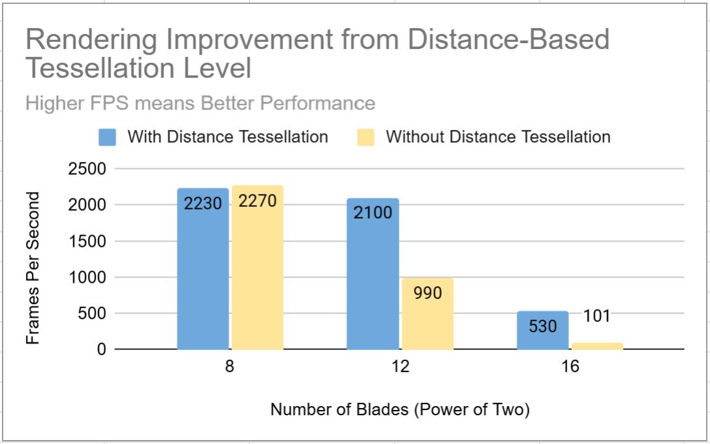

Vulkan Grass Rendering
==================================

**University of Pennsylvania, CIS 565: GPU Programming and Architecture, Project 5**

### Yuhan Liu

[LinkedIn](https://www.linkedin.com/in/yuhan-liu-), [Personal Website](https://liuyuhan.me/), [Twitter](https://x.com/yuhanl_?lang=en)

**Tested on: Windows 11 Pro, Ultra 7 155H @ 1.40 GHz 32GB, RTX 4060 8192MB (Personal Laptop)**

 

In this project, I created a real-time grass simulation and rendering application using Vulkan. Each blade of grass is represented by a Bezier curve, enabling realistic motion and appearance. The simulator uses compute shaders for physics calculations and for culling non-visible blades to improve performance. After culling non-necessary blades, the remaining are passed through the graphics pipeline for rendering. The pipeline includes a vertex shader to transform Bezier control points, tessellation shaders to dynamically create the grass geometry from the Bezier curves, and a fragment shader to shade the grass blades.

This project is an implementation of the paper, [Responsive Real-Time Grass Rendering for General 3D Scenes](https://www.cg.tuwien.ac.at/research/publications/2017/JAHRMANN-2017-RRTG/JAHRMANN-2017-RRTG-draft.pdf).

## Vulkan Rendering

This project uses the Vulkan API to build a grass simulator and renderer that operates at real-time performance. It leverages a compute shader to apply physics to Bezier curve representations of individual grass blades. By culling non-visible grass blades in each frame, compute shaders optimize efficiency. The remaining visible blades are sent through a graphics pipeline with vertex, tessellation, and fragment shaders to transform, shape, and render them in detail.

## Representing Grass as Bezier Curves

 

Grass blades are represented as Bezier curves, defined by three control points ```(v0, v1, v2)```. Each point carries specific roles: ```v0``` anchors the blade on the ground, ```v1``` serves as a guiding point above ```v0```, and ```v2``` is used for physics-based transformations. Additional blade attributes include orientation, height, width, up vector, and stiffness, which are compactly stored across four ```vec4``` values. These attributes facilitate realistic grass movement and structural integrity in the simulation.

During rendering, each blade is drawn as a 2D object positioned in 3D space. By evaluating the curve interpolation of the control points for each generated vertex, the quad becomes aligned to the Bezier curve, and this is achieved using De Casteljau's algorithm (Jahrmann & Wimmer). 

## Simulating Forces

Simulating forces, namely gravity, recovery, and wind, involves updating the ```v2``` control point of each grass blade's Bezier curve. Total force is computed and applied as translation to ```v2```, ensuring blades remain stable and preserve length by correcting ```v1``` and ```v2``` positions. These forces are all applied in a compute shader. 

|Force|Details|Result|
|---|---|---|
| **No Forces** | Result of rendering 4,096 blades of grass with no additional forces. |  |
| **Gravity**: computed with both environmental and front-facing components, acts downward on each blade. | Environment gravity represents the downward gravity of the whole scene, whereas front gravity simulates each blades' individual elasticity, causing the tips to bend. With onyl gravity as a force applied, the blades squah down towards the plane. |  |
| **Recovery**: derived from Hooke's Law, counteract deformation, restoring blades to their initial position | Recovery counters the gravity force by factoring the blades' stiffness. This force brings structure back into the blades. |  |
| Wind: calculated with custom heuristic functions, considers blade position and time to produce swaying effect. | The impact of this force depends on the winds' strength and direction, as well as the position of the blade. In my renderer, the wind blows across the x-direction in sequential gusts. The impact of the wind also depends on the alignment of the blade: straighter blades are more affected than blades closer to the ground. |  |

### State Validation

In addition to physical forces, I implemented state validation conditions to ensure that blades of grass are confined to legal positions. I use the following conditions: ```v2``` must not be pushed underneath the ground, ```v1``` must be set according to ```v2```, and the length of the curve must be equal to the height of the grass blade. 

## Culling Blades

Although we need to simulate forces on every grass blade at every frame, there are many blades that we won't need to render due to a variety of reasons. Culling optimizes performance by removing non-contributing grass blades from the render pipeline. Three main culling techniques are employed in the compute shader:

|Culling Type|Details|Result|
|---|---|---|
| **Orientation Culling**: Removes blades perpendicular to the view vector, as these would appear too thin and create artifacts. | The thinnest blade of grass in the GIF to the right is culled based on the camera's view. |  |
| **Frustum Culling**: Discards blades entirely outside the camera’s view, based on the visibility of control points ```v0```, ```v2```, and midpoint ```m```. | Notice that blades on the edges of the screen space are culled. This threshold is adjustable, and indicates that unseen blades will not be rendered. |  |
| **Distance Culling**: Blades far from the camera are culled to avoid rendering details that are indistinguishable at a distance. | As seen in the GIF, blades are culled based on their distance to the camera, which is defined by adjustable, discrete levels. |  |

### Performance Improvements

 

I conducted a performance analysis on the improvement from culling techniques for rendering 2^14 blades of grass. In analyzing the performance of different culling techniques, we see that combining multiple culling methods significantly optimizes rendering speed, as reflected in FPS improvements. 

Comparing the effectiveness of each culling technique reveals distinct strengths and limitations. Frustum culling, at 530 FPS, specifically targets blades outside the camera’s view, helping reduce the load but missing potential optimizations related to distance. Orientation culling offers a moderate performance improvement, reaching 660 FPS by discarding blades not directly facing the camera. However, it doesn’t account for blades that fall outside the field of view or are too distant to be noticeable, so its impact is limited. Distance culling is notably more effective, achieving 1050 FPS by removing blades beyond a specified range, a factor that greatly minimizes the number of blades processed for rendering while maintaining visual fidelity. 

When used together, all three culling methods produce the best results, with an FPS of 1150, as each technique filters out a unique subset of blades, ultimately reducing the computational burden more effectively than any single technique alone.

## Tessellating Bezier curves into grass blades

Each Bezier curve passes into the grass graphics pipeline as a patch, then tessellated in the tessellation control shader. This step generates vertices that shape each blade’s quad geometry. The tessellation evaluation shader then positions these vertices in world space, adjusting them to match the blade’s width, height, and orientation. This process creates detailed, lifelike grass blades that reflect their underlying Bezier curves and attributes, producing a visually accurate and efficient rendering.

### Distance-Based Level of Detail

I modified the tessellation shader for rendering grass by introducing a dynamic level of detail based on the distance from the camera. By calculating the distance between each grass blade and the camera position, the shader adjusts the tessellation levels accordingly: blades closer than 15 units receive a high tessellation level of 20, those between 15 and 25 units receive a medium level of 6, and blades beyond 25 units are assigned a low level of 4. This distance-based approach enhances performance by reducing the complexity of rendering distant blades while maintaining visual fidelity for closer ones, optimizing the overall rendering process in a scene with varying levels of detail.

 

The blade shown in left image has tesselation level of 4 because it is at the farthest distance level. After moving the camera closer towards the blade as seen in the right image, the blade is rendered at a higher tesselation level of 20, producing a smoother curve.

 

The performance analysis of the tessellation shader reveals significant improvements when incorporating distance-based tessellation. For 8 blades, the rendering time with distance tessellation is 2230 milliseconds, only slightly better than the 2270 milliseconds required without distance tessellation. However, as the number of blades increases, the benefits become more pronounced. At 12 blades, the rendering time dramatically decreases from 990 milliseconds without distance tessellation to 2100 milliseconds with it, showcasing an efficient use of resources as complexity grows. The most striking difference occurs at 16 blades, where the time plummets to just 530 milliseconds with distance tessellation compared to 101 milliseconds without. In short, distance-based tessellation effectively optimizes performance, particularly as the scene's complexity increases.

### Complex Blade Shapes

Inspired by the paper's investigation into more complex blade shapes (the paper discusses creating a dandelion leaf, but does not specify the equation used for it), I experimented with different interpolation parameter equations that produced the following various blade types: 

|Basic Blade|Spiky Blade|Bubble Blade|
|---|---|---|
|  |  |  |
| Triangular interpolation, follows equation given in paper. | Add symmetric sinusoidal displacement to create ridges, with smoothstep to lower spike amplitude towards tip. | Rounder displacement that forms "bubbles" around a blade. Also angled/tilted for aesthetic variation. |

I combined the above blade types into one final scene. To do this, in the tessellation evaluation shader, I added a generic hash function that maps each blade's X and Y position to a float on the interval [0,1]. The value of this float determines which blade shape it is to take on, with basic blades being the most common and bubble blades being the rarest. The blade type is then passed to the fragment shader, in which each blade type is assigned different pairs of colors that are interpolated. 

It's also worthy to note that the displaced blade types require high tessellation levels for good results. A closeup GIF is provided below:


### Overall Performance Analysis

 

The above performance graph examines the overall renderer runtime for increasing numbers of blades. Note that all three blade types were present, and distance-based tessellation is off. 

As expected, FPS declines as the number of blades increases. Starting with 6 blades, the system achieves a robust FPS of 2300, and this slightly improves to 2320 FPS at 2^8 blades, indicating comparable discrepancy as well as efficient rendering at lower complexities. However, as the number of blades continues to rise, the FPS experiences a sharp drop. At 2^10 blades, the FPS decreases to 2260, suggesting a minor impact on performance. At 2^18 blades, the FPS falls to 34, indicating that the system is struggling to maintain performance under higher complexity in a dense scene. Nonetheless, 30 FPS is the frame rate widely used for media like TV and games, which still preserves the perception of real-time motion. To support this, I included a GIF of the scene with 2^18 blades, showing wind that is still relatively smooth and a rather satisfying sense of lush grass movement in the scene. 

 

### Bloopers (that Produced Cool Imagery)

The following images are included just for fun. These were bloopers I encountered in my development process that resulted in some rather cool effects. 


I encountered this result when trying to map different blade types to different color pairs between the tessellation evaluation shader and the grass fragment shader. I determined color from the hash function using discrete comparison instead of range buckets, producing the colored stripes on the blade.

 
I really like the output of this specific mix of bugs. The colored stripes from the above scenario combines with interpolating blade color based on normals instead of y-position. I might add this to a branch and explore it a bit on the technical art side (with additional shaders)? It reminds me of the 2D, pattern-like flora art style of [Henri Rousseau](https://henrirousseau.org/)

